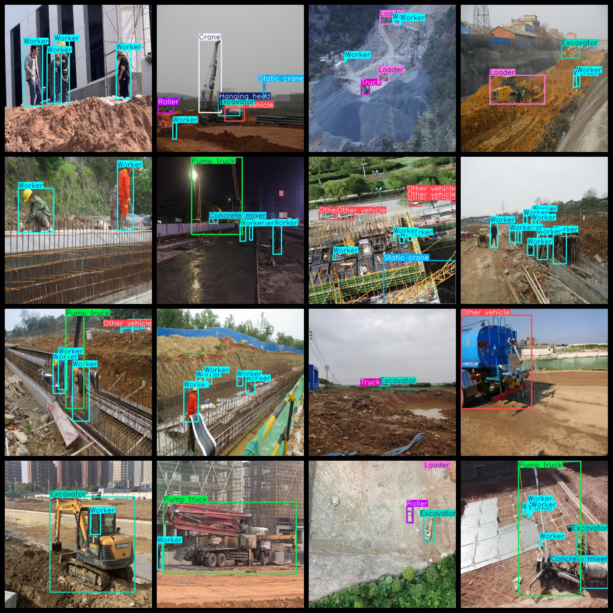
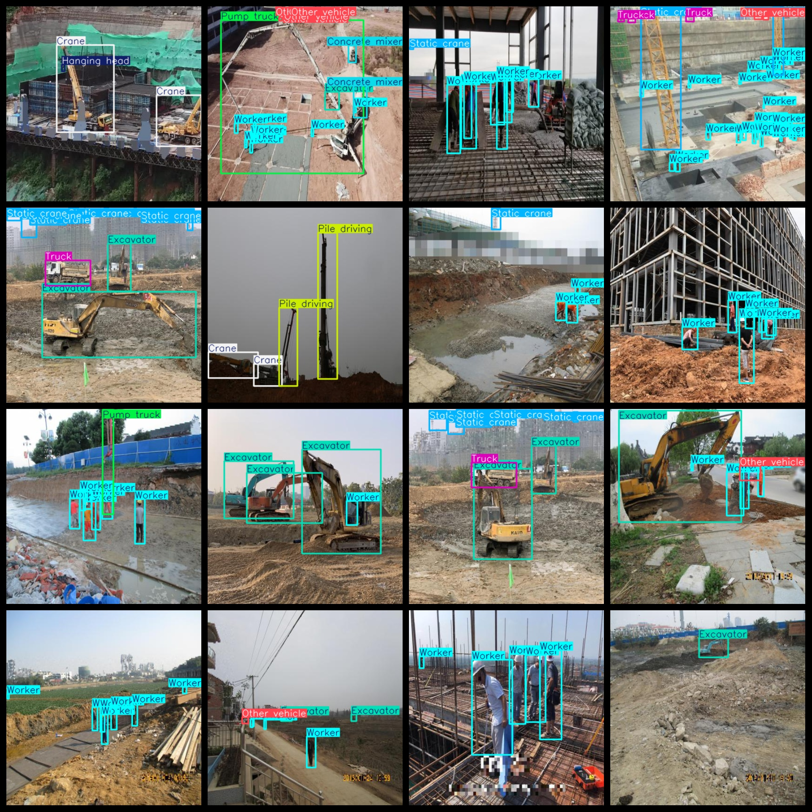

# 【】
The dataset is a collection of images captured by YOLO (You Only Look Once) technology, specifically designed for the detection of heavy equipment on construction sites. The images are in the VOC+ format, which means they are annotated with ground truth labels and annotations that can be used for training and evaluation purposes. The dataset contains 9210 images in total, providing a comprehensive resource for researchers and practitioners in the field of smart construction.

This dataset, "Smart Construction Site Engineering Vehicle Heavy Equipment Detection Dataset 9210 imagesVOC+YOLO format," is a collection of 9210 images in Pascal VOC and YOLO format. It consists of JPG images along with their corresponding VOC-formatted XML files and YOLO-formatted TXT files. The dataset is not split into training, validation, or testing sets; it requires the user to organize and label the data accordingly.

The dataset includes 9210 annotations, which are organized as follows:
- Number of VOC-formatted XML files: 9210
- Number of YOLO-formatted TXT files: 9210
- Number of annotation files (labels): 9210
- Number of categories: 13

The labels for each category follow the order specified in the "labels" folder's "classes.txt" file: ["Bulldozer", "Concrete mixer", "Crane", "Excavator", "Hanging head", "Loader", "Other vehicle", "Pile driving", "Pump truck", "Roller", "Static crane", "Truck", "Worker"]

Each category has been labeled with its respective number of bounding boxes (boxes). The counts are as follows:
- Bulldozer: 457 boxes
- Concrete mixer: 697 boxes
- Crane: 1184 boxes
- Excavator: 4446 boxes
- Hanging head: 1271 boxes
- Loader: 406 boxes
- Other vehicle: 2338 boxes
- Pile driving: 426 boxes
- Pump truck: 617 boxes
- Roller: 404 boxes
- Static crane: 3350 boxes
- Truck: 2360 boxes
- Worker: 36271 boxes

The total number of bounding boxes across all categories is 54227. Each category is represented by a different number of images. For example:
- Bulldozer: 400 images
- Concrete mixer: 476 images
- Crane: 941 images
- Excavator: 3151 images
- Hanging head: 1009 images
- Loader: 386 images
- Other vehicle: 1216 images
- Pile driving: 264 images
- Pump truck: 557 images
- Roller: 339 images
- Static crane: 1708 images
- Truck: 1376 images
- Worker: 7404 images

The image resolution is 416x416 pixels. The dataset uses the labelImg tool for annotating the images. As for enhancements, this dataset does not undergo any enhancements at this time. Additionally, the dataset does not include any preprocessing steps or splitting into training, validation, or test sets, which would need to be done by the user.

It is important to note that the dataset does not guarantee the accuracy of models trained on it or the weights of the model. All data and annotations are provided directly from the dataset itself.

## Images

---

Here is a pay link on Stripe (https://buy.stripe.com/3cs8yP7sY87d0vu9AB). Please contact me lonlonago@foxmail.com after funding $89, and I will send you a complete data files, thank you!

